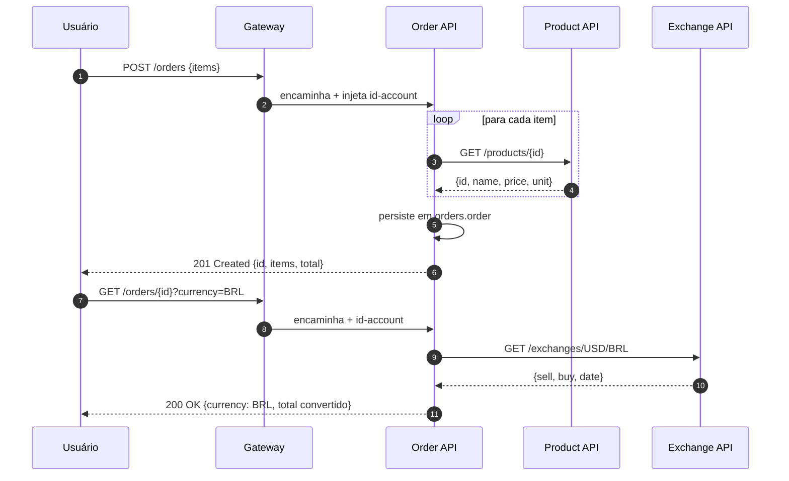

# Order API — Documentação Individual

**Aluno:** Lucas Ikawa
**Grupo:** Alex Chequer · Carlos · Lucas Ikawa
**Disciplina:** Plataformas, Microserviços, DevOps e APIs — Insper 2026.1
**Instrutor:** Humberto Sandmann

---

## O que é este site

Documentação individual da minha contribuição para o projeto da disciplina:
o microsserviço **Order API**, parte da plataforma de e-commerce desenvolvida
em grupo. Aqui você encontra:

- [Documentação dos exercícios](exercicios/index.md) realizados durante o curso
- [Documentação do projeto em grupo](projeto/index.md) (visão geral, arquitetura, apresentação)
- [Documentação do microsserviço Order](individual/index.md) (responsabilidade individual)
- Os **[bottlenecks implementados](individual/bottlenecks.md)** no Order API
- [Links para todos os repositórios](repositorios.md) usados pelo grupo

## Distribuição de microsserviços

| Membro | Microsserviço | Stack |
|--------|---------------|-------|
| Alex Chequer | Exchange API | Python · FastAPI |
| Carlos | Product API | Java · Spring Boot |
| **Lucas Ikawa** | **Order API** | **Java · Spring Boot** |

Os serviços compartilhados (Account, Auth, Gateway) foram desenvolvidos colaborativamente.

## Visão rápida do Order API

API REST que gerencia pedidos do usuário autenticado. Integra com **product-service**
(via OpenFeign) para validar produto e capturar preço, e com **exchange-service**
(via OpenFeign) para conversão de moeda nos totais retornados.

Detalhes em [Order API → Visão geral](individual/index.md).
