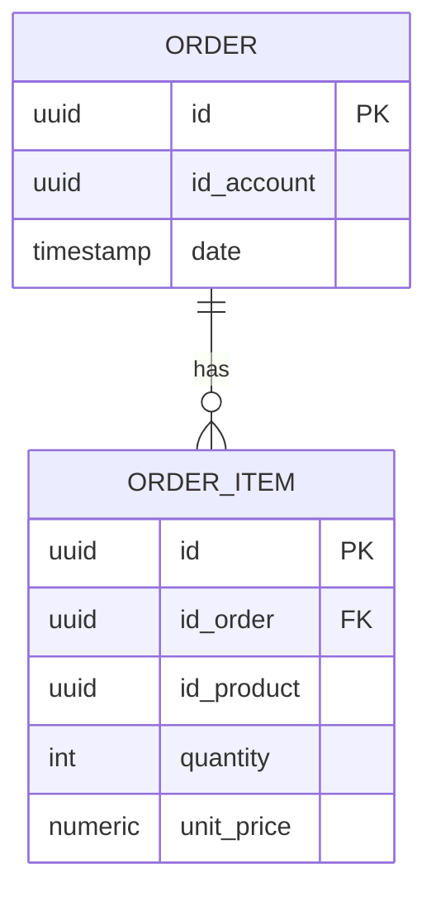

# Order API — Visão geral

Microsserviço REST que gerencia pedidos do usuário autenticado.
**Responsável:** Lucas Ikawa.

## Stack

| Item | Detalhe |
|------|---------|
| Linguagem | Java 25 |
| Framework | Spring Boot 4.0.3 |
| Inter-service | Spring Cloud OpenFeign |
| Banco | PostgreSQL 17 (schema `orders`) |
| Migrações | Flyway |
| Observabilidade | Micrometer · Prometheus · `/actuator/prometheus` |
| API docs | SpringDoc / OpenAPI · `/swagger-ui/index.html` |
| Validação | Jakarta Validation (`@Valid`, `@NotEmpty`, `@Size`, `@Max`, `@Positive`) |

## O que foi entregue

- ✅ Migração Flyway `V1__create_orders_tables.sql` criando `orders.order` e `orders.order_item`
- ✅ Entidades JPA `Order` / `OrderItem` (`order` é palavra reservada — tabela quoted)
- ✅ Repositórios `OrderRepository` / `OrderItemRepository` com filtragem por `id_account`
- ✅ Feign clients `ProductClient` e `ExchangeClient` (URLs injetadas via env)
- ✅ DTOs: `OrderRequest`, `OrderCreatedResponse` (sem currency), `OrderSummaryResponse`,
  `OrderDetailResponse` (com currency)
- ✅ Endpoints: `POST /orders`, `GET /orders`, `GET /orders/{id}?currency=`
- ✅ Conversão de moeda via Exchange (`buy` rate)
- ✅ **Mapeamento correto de erros**: 404 (acesso a pedido alheio), 400 (produto
  inexistente), 422 (moeda não suportada)
- ✅ **Authorization by role** (`id-role: admin`) — endpoint extra `GET /orders/all`
- ✅ **Validações** rigorosas (`@Size(max=100)`, `@Max(10_000)`, `@NotEmpty`)
- ✅ **`@RestControllerAdvice`** retornando `ProblemDetail` com mapa por campo
- ✅ **Counter Micrometer** (`orders.created`) exposto em Prometheus
- ✅ **OpenAPI / Swagger UI**

## Diretório

```
src/main/java/store/order/
├── OrderApplication.java        # @SpringBootApplication + @EnableFeignClients
├── Order.java                   # @Entity orders."order"
├── OrderItem.java               # @Entity orders.order_item
├── OrderRepository.java
├── OrderItemRepository.java
├── OrderService.java            # business logic (Transactional)
├── OrderController.java         # endpoints (RBAC via id-role)
├── Role.java                    # enum USER / ADMIN
├── GlobalExceptionHandler.java  # ResponseEntityExceptionHandler
├── OpenApiConfig.java           # OpenAPI bean (SpringDoc)
├── client/
│   ├── ProductClient.java       # @FeignClient name=product-service
│   ├── ProductResponse.java
│   ├── ExchangeClient.java      # @FeignClient name=exchange-service
│   └── ExchangeResponse.java
└── dto/
    ├── OrderRequest.java
    ├── OrderCreatedResponse.java
    ├── OrderSummaryResponse.java
    └── OrderDetailResponse.java
src/main/resources/
├── application.yaml
└── db/migration/
    └── V1__create_orders_tables.sql
```

## Diagrama do banco



## Histórico de commits

A implementação foi versionada em commits separados por funcionalidade:

| Commit | Descrição |
|--------|-----------|
| `feat: add orders schema migration and JPA entities` | Migração Flyway, entidades, repositórios |
| `feat: add Feign clients for product and exchange services` | OpenFeign + DTOs de resposta |
| `feat: implement order REST API with currency conversion` | Service, controller, DTOs, validação |
| `feat: add role-based authorization with admin-only listing` | Role enum + endpoint admin |
| `feat: tighten input validation and return field-level error details` | `@Size`, `@Max`, GlobalExceptionHandler |
| `feat: count created orders via Micrometer` | Counter `orders.created` |
| `feat: expose OpenAPI spec and Swagger UI via SpringDoc` | OpenApiConfig + dependência |

Veja o histórico completo em [`order-service` › Commits](https://github.com/Microservice-Alex-Carlos-Lucas/order-service/commits/main).

## Como rodar

```bash
# Pré-requisito: Postgres ativo (docker compose up db)
cp .env.example .env
set -a; source .env; set +a
mvn spring-boot:run
```

A aplicação sobe em [http://localhost:8080](http://localhost:8080) e expõe:

- API: `/orders`
- Swagger UI: `/swagger-ui/index.html`
- OpenAPI JSON: `/v3/api-docs`
- Métricas: `/actuator/prometheus`
- Health: `/actuator/health`
