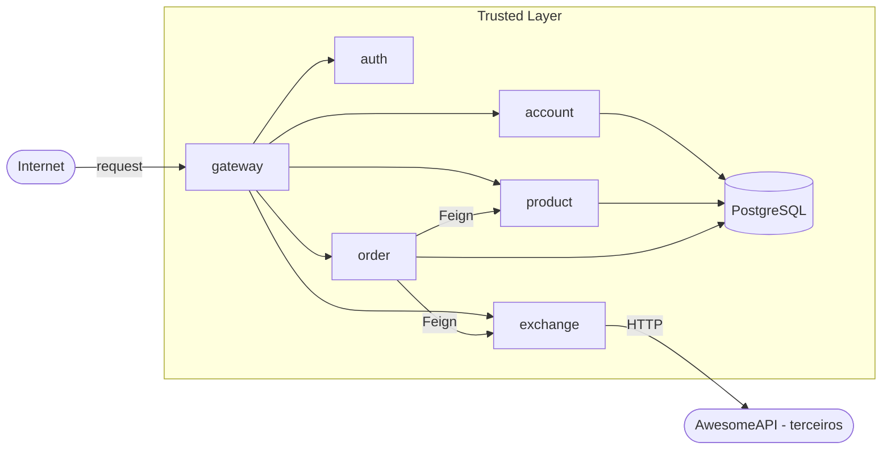
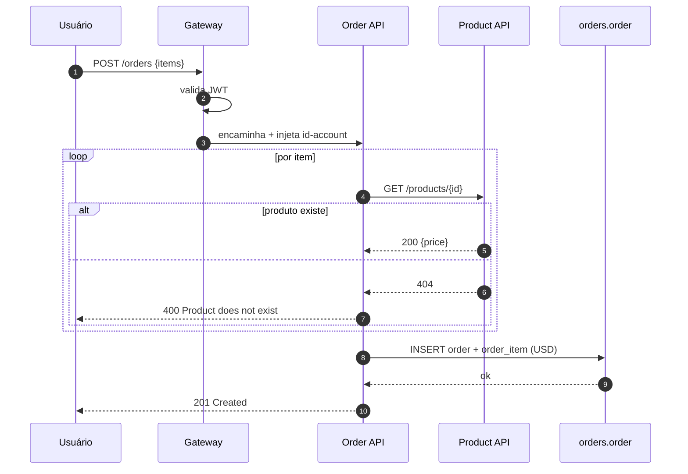
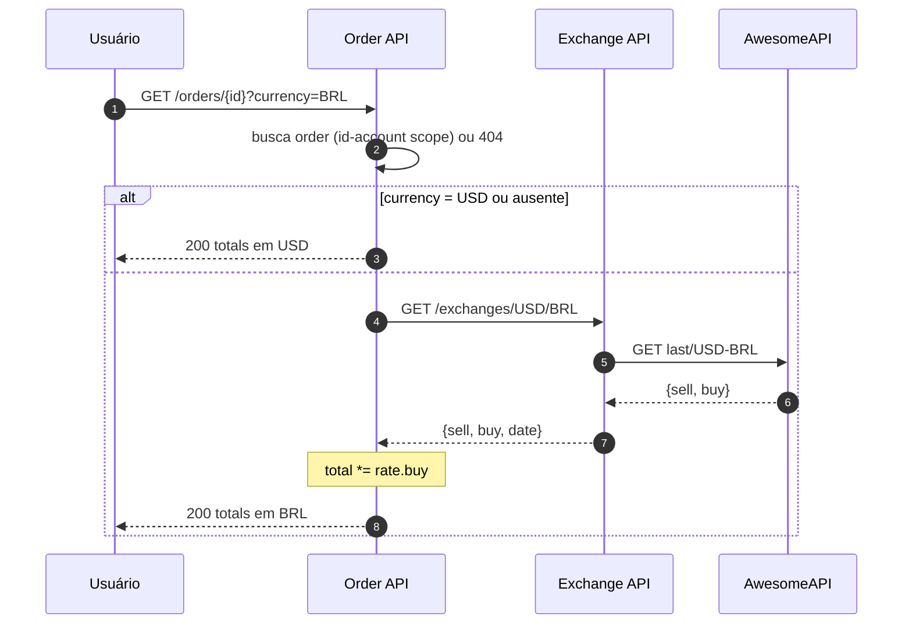

# Arquitetura

## Visão lógica

| Camada | Componente | Tecnologia |
|--------|-----------|------------|
| Borda | Gateway | Spring Cloud Gateway (WebFlux) |
| Identidade | Auth | Spring Boot · JWT |
| Domínio | Account · Product · Order | Spring Boot 4 · PostgreSQL · Flyway |
| Domínio | Exchange | FastAPI · proxy AwesomeAPI |
| Persistência | Database por serviço | PostgreSQL 17, schema-por-serviço |
| Observabilidade | Métricas | Prometheus (`/actuator/prometheus`) |
| Empacotamento | Containers | Docker · Compose · Kubernetes |

## Padrões adotados

- **API Gateway** centraliza CORS e injeta o header `id-account` (UUID) em rotas autenticadas
- **Database per service**: cada serviço tem seu próprio *schema* no Postgres (`accounts`, `products`, `orders`)
- **Migrations** versionadas com Flyway (V1__create_..._table.sql)
- **Inter-service via OpenFeign** (síncrono, declarativo) com URLs injetadas por env
  (`PRODUCT_SERVICE_URL`, `EXCHANGE_SERVICE_URL`)
- **Observabilidade**: cada serviço expõe `/actuator/prometheus` (Java) ou `/metrics` (Python)
- **Autorização** delegada ao gateway (validação JWT) + headers `id-account` / `id-role`
  consumidos por cada serviço

## Fluxo de criação de pedido

## Fluxo de conversão de moeda

## Decisões de design relevantes para o Order

- **Preço armazenado em USD** no `order_item.unit_price` — moeda única de armazenamento;
  conversão é aplicada na leitura.
- **Persistência transacional** (`@Transactional` em `create`) — todos os `order_item`
  ou nenhum.
- **Falha em produto inexistente** mapeada para `400 BAD_REQUEST` (a página do
  exercício pede esse status).
- **Falha de exchange** (moeda inválida ou upstream indisponível) mapeada para
  `422 UNPROCESSABLE_ENTITY` (também conforme a página).
- **Filtragem por `id_account`** garante que um usuário só enxergue os próprios
  pedidos (respondemos `404`, não `403`, pra não vazar existência).
