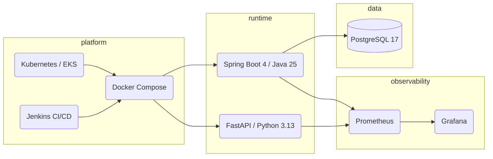

# Projeto — Visão geral

**Nome:** Store Platform
**Grupo:** Alex Chequer · Carlos · Lucas Ikawa
**Repositório raiz:** [microservices](https://github.com/Microservice-Alex-Carlos-Lucas/microservices)
**Documentação de grupo:** [GitHub Pages](https://microservice-alex-carlos-lucas.github.io/microservices/)

## Descrição

Plataforma de e-commerce com **arquitetura de microsserviços**. O usuário se autentica,
navega produtos, e cria pedidos que podem ser visualizados em diferentes moedas.
Cada microsserviço é independente, com banco próprio (ou stateless, no caso do
Exchange e do Gateway), orquestrado via Docker Compose para desenvolvimento e
Kubernetes (EKS) para produção.

## Microsserviços

| Microsserviço | Responsabilidade | Stack |
|---------------|------------------|-------|
| **Gateway** | Roteamento HTTP, CORS, injeção de `id-account` autenticado | Spring Cloud Gateway |
| **Auth** | Login + emissão de JWT | Spring Boot |
| **Account** | Cadastro e consulta de contas | Spring Boot · PostgreSQL |
| **Product** | CRUD de produtos | Spring Boot · PostgreSQL |
| **Order** *(individual de Lucas)* | Pedidos · integração com Product e Exchange | Spring Boot 4 · PostgreSQL · OpenFeign |
| **Exchange** | Conversão de moedas (proxy AwesomeAPI) | Python · FastAPI |

## Funcionalidades-chave

- Cadastro e login de usuário (Auth + Account)
- Catálogo de produtos com preço em USD (Product)
- Criação de pedidos validando produtos em tempo real (Order → Product via Feign)
- Visualização do total do pedido em **qualquer moeda** suportada pela
  AwesomeAPI (Order → Exchange via Feign)
- Autorização baseada em `role` (`user` / `admin`)
- Observabilidade via Prometheus + Actuator
- Documentação OpenAPI/Swagger por serviço

## Tecnologias

## Status de entrega

| Tarefa | Peso | Status |
|--------|------|--------|
| API Gateway | 5% | ✅ Concluído |
| Auth | 5% | ✅ Concluído |
| Account | 5% | ✅ Concluído |
| Exchange API | 5% | ✅ Concluído |
| Product API | 5% | ✅ Concluído |
| **Order API** | 5% | ✅ Concluído |
| Bottlenecks (≥2/membro — 6 implementados + medidos) | 20% | ✅ Concluído |
| AWS / EKS (cluster `store-cluster` em us-east-1) | 15% | ✅ Concluído |
| CI/CD Jenkins (8 pipelines verdes, Build + Push + Deploy to EKS) | 10% | ✅ Concluído |
| Load Testing (k6 + HPA validados) | 15% | ✅ Concluído |
| Custos & PaaS & SLA | 10% | ✅ Concluído |

Status mestre mantido no [repositório raiz](https://github.com/Microservice-Alex-Carlos-Lucas/microservices/blob/main/docs/index.md).

## Documentação completa do grupo

- Arquitetura: [microservices › docs/architecture.md](https://github.com/Microservice-Alex-Carlos-Lucas/microservices/blob/main/docs/architecture.md)
- Bottlenecks por membro: [microservices › docs/bottlenecks.md](https://github.com/Microservice-Alex-Carlos-Lucas/microservices/blob/main/docs/bottlenecks.md)
- Apresentação: [microservices › docs/presentation.md](https://github.com/Microservice-Alex-Carlos-Lucas/microservices/blob/main/docs/presentation.md)
- Custos: [microservices › docs/costs.md](https://github.com/Microservice-Alex-Carlos-Lucas/microservices/blob/main/docs/costs.md)
- Load testing: [microservices › docs/load-testing.md](https://github.com/Microservice-Alex-Carlos-Lucas/microservices/blob/main/docs/load-testing.md)
